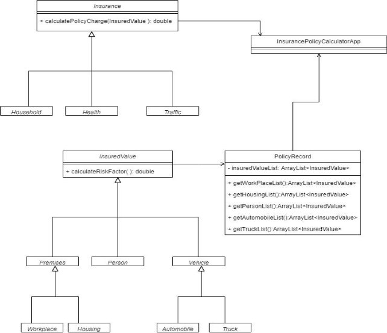

# CENG211 – Programming Fundamentals

## Insurance Policy Charge Calculator ##

In this homework you are expected to implement an “Insurance Policy Charge Calculator” in Java.  You should fulfill the concepts of: 

- Inheritance 
- Polymorphism 
- ArrayLists 

In this application there are insured values which/who has an insurance number and year of insurance. The insured values could be either a premises, a person or a vehicle. A premises could be either a workplace or a housing. A vehicle could be either an automobile or a truck.  

A file that consists of different insured values’ information is given: HW2\_InsuredValues.csv. The columns of this file is given in the following for each different insured value. 

Workplace: ***insurance number, year of insurance, premises city, number of floors, year of construction, type of construction, surface area, annual revenue*** 

Housing: ***insurance number, year of insurance, premises city, number of floors, year of construction, type of construction, surface area, resident situation*** 

 Person: ***insurance number, year of insurance, residence city, name, national id, gender, year of birth, type of chronicle illness*** 

 Automobile: ***insurance number, year of insurance, plate city, engine volume, year of production, type of gear, fuel tank volume, type of roof*** 

 Truck: ***insurance number, year of insurance, plate city, engine volume, year of production, type of gear, fuel tank volume, type of truck bed*** 

Note that, the insurance numbers of insured values start with prefix ‘A’ for automobile, ‘P’ for person and so on. The information that are given in the attached file will be used to calculate the risk factor of each insured value. Each column of information, such as number of floors in a premises, might affect the final value of an insured values total risk factor. The following tables show the risk factor values of different columns such as the year of construction of a premises.  


|Premises city |Izmir  |Istanbul  |Ankara |Other |
| - | - | - | - | - |
|Risk factor value |0.4 |0.6 |0.15 |0.25 |


|Number of floors |1 to 3 |4 to 7 |8 to 18 |more than 18  |
| - | - | - | - | :-: |
|Risk factor value |0.1 |0.25 |0.5 |0.85 |


|Year of construction |- 1975 |between 1975 and 1999  |- 1999 |
| - | - | - | - |
|Risk factor value |0.58 |0.32 |0.1 |

|Type of construction |Steel |Concrete |Wood |Other |
| - | - | - | - | - |
|Risk factor value |0.1 |0.37 |0.58 |0.92 |


|Resident Situation |Tenant |Landlord |
| - | - | - |
|Risk factor value |0.18 |0.42 |


|Type of chronicle illness |Cardiovascular |Diabetes |Respiratory |Other |None |
| - | - | - | - | - | - |
|Risk factor value |1.85 |1.84 |1.86 |1.8 |0.1 |


|Plate city |Izmir  |Istanbul  |Ankara |Other |
| - | - | - | - | - |
|Risk factor value |0.78 |0.97 |0.85 |0.65 |


|Type of gear  |Manual |Automatic |
| - | - | - |
|Risk factor value |0.47 |0.98 |


|Type of roof |Regular |Sunroof |Moon roof |
| - | - | - | - |
|Risk factor value |0.1 |0.64 |0.48 |


|Type of truck bed |Trailer |Tanker |Regular |
| - | - | - | - |
|Risk factor value |0.87 |0.84 |0.15 |

The following formulas show how the risk factor of each insured value is calculated. Note that, the meaning of for example, year of construction, in formula is the risk factor value of year of construction in table above. However, the value of for example, engine volume could be obtained from the attached file.  

**Risk factor of workplace** = (premises city \* number of floors \* year of construction \* type of construction) \* (surface area \* 0.2) \* (annual revenue \* 0.003)  

**Risk factor of housing** = [(premises city \* number of floors \* year of construction \* type of construction) \* (surface area)] / resident situation 

**Risk factor of person** = age2 / (type of chronicle illness \* 18) 

**Risk factor of automobile** = (engine volume \* (0.004 \* fuel tank volume) \* age \* (plate city \* 0.03)) / type of roof 

**Risk factor of truck** = [(age3 / (0.008 \* fuel tank volume)) \* engine volume \* (plate city \* 0.03)] / type of truck bed2 

In order to calculate insurance policy charges, there are different types of insurances in this application which are household, health and traffic. The following formulas show how the policy charge of each insurance is calculated. Note that each insurance has a fixed fee which is randomly initialized between 1000 TL and 3000 TL.  

**Policy charge of household insurance =** fixed fee \* (risk factor)2, if the ranking of the insurance is more than 2, a %10 discount is applied to the charge of policy. The rank of the insurance is calculated as **(2020 – year of insurance)**  

**Policy charge of health insurance =** [fixed fee \* (risk factor)3] / 208. If the risk factor of the person who wants to have a health insurance is more than 50 and the ranking of the insurance is less than 3, then the policy charge is automatically 1.000.000.000 TL which means that the insurance application is denied.  

` `**Policy charge of traffic insurance =** (%90 of fixed fee) + (fixed fee \ √riskFactor ). Also, if the ranking of the insurance is more than 1, a %20 discount is applied in charge of the policy.  

Also, in this application, there is a policy record class which holds an array list of the insured values. There should be methods in this class which are explained in the following: 

```
- A method that returns an array list of all of the workplace insured values 
- A method that returns an array list of all of the household insured values 
- A method that returns an array list of all of the person insured values 
- A method that returns an array list of all of the automobile insured values 
- A method that returns an array list of all of the truck insured values 
```

Additional methods could be added to the policy record class if necessary.  

In this application, you are expected to read the given files automatically and to create the necessary objects. You should create a policy record that holds all of these created objects and could classify these into categories such as workplace or automobile etc. In this application the only input that is taken from the user is an integer. Please do not ask **any other input**. With the help of policy record, the insured value’s policy charge should be calculated and outputted on the console as in the following: 

```
**1 All insured values, 2 Workplaces, 3 Housings, 4 Persons, 5 Automobiles, 6 Trucks. Please enter your choice: 1** 

**Insured Value: Truck Insurance Number: T7412 Year of Insurance: 2012** 

**The policy charge of T7412: ………… TL** 

**Insured Value: Person Insurance Number: P9354 Year of Insurance: 2019** 

**The policy charge of T7412: ………… TL** 
```

**…………………………………………………………………………………………………………………** 

Below in **Figure 1** you will find the class diagram which may help you in the design of the program. Note that, all of the calculations and risk factor values are made up and are not taken from real life.  



**Figure 1.** Class Diagram of Insurance Policy Calculator App 
